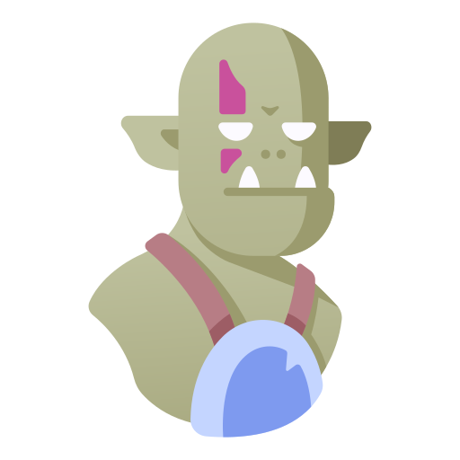

    

# Tic Tac Toe Quest

This is a sample project created in the most performant JavaScript framework, [Vanilla.js](http://vanilla-js.com/).  Feel free to look over the code if you would like, this is not super optimized at the moment the only fancy thing here is webpack and sass.  I'm injecting all the elements into the DOM and creating the game with plain Javascript and CSS.

feel free to look at [my trello board](https://trello.com/b/rclBgbLj) for details on my thought process.

# Future Features
- Inventory system with fun randomly found power ups
- Health tracking and loss conditions
- Local Storage persistence
- Much more, stay tuned!

